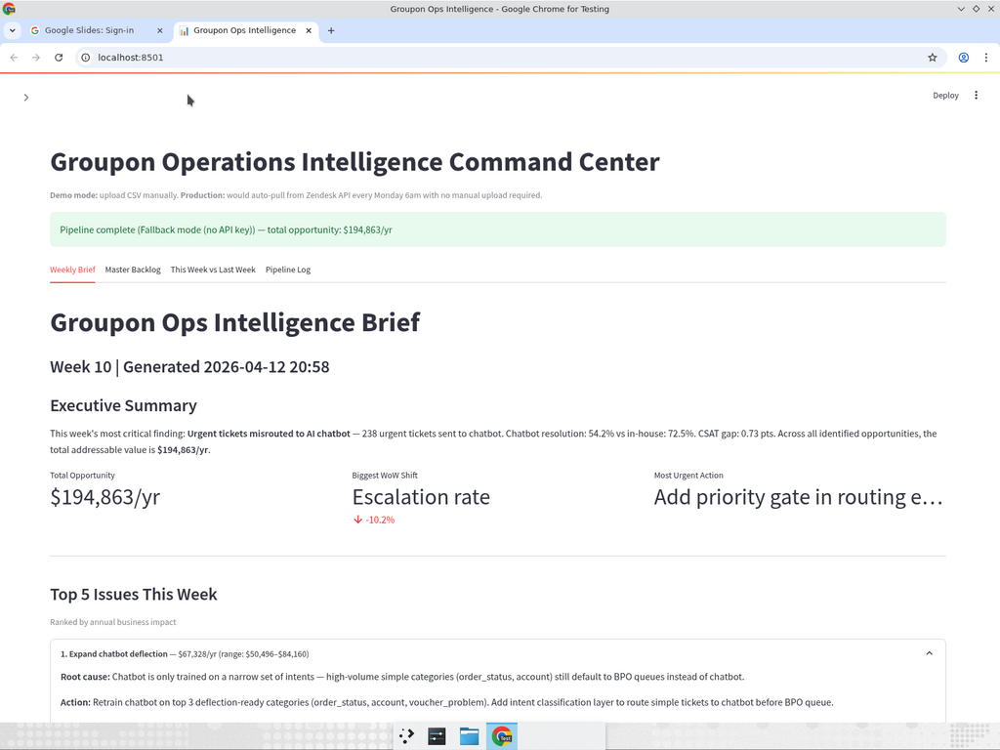
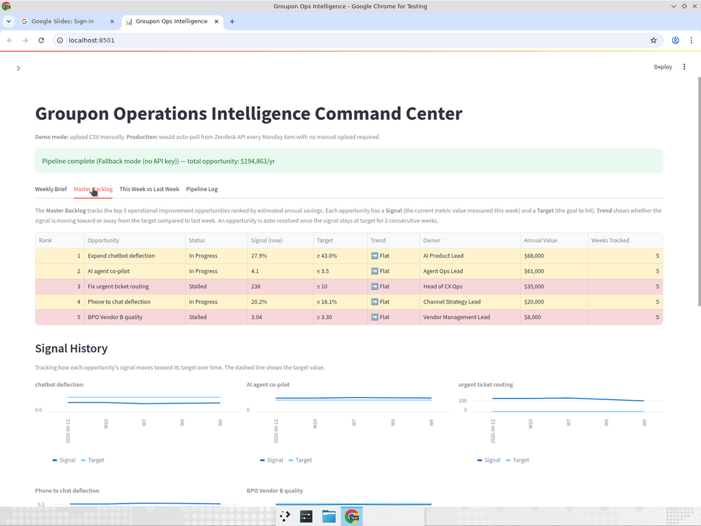
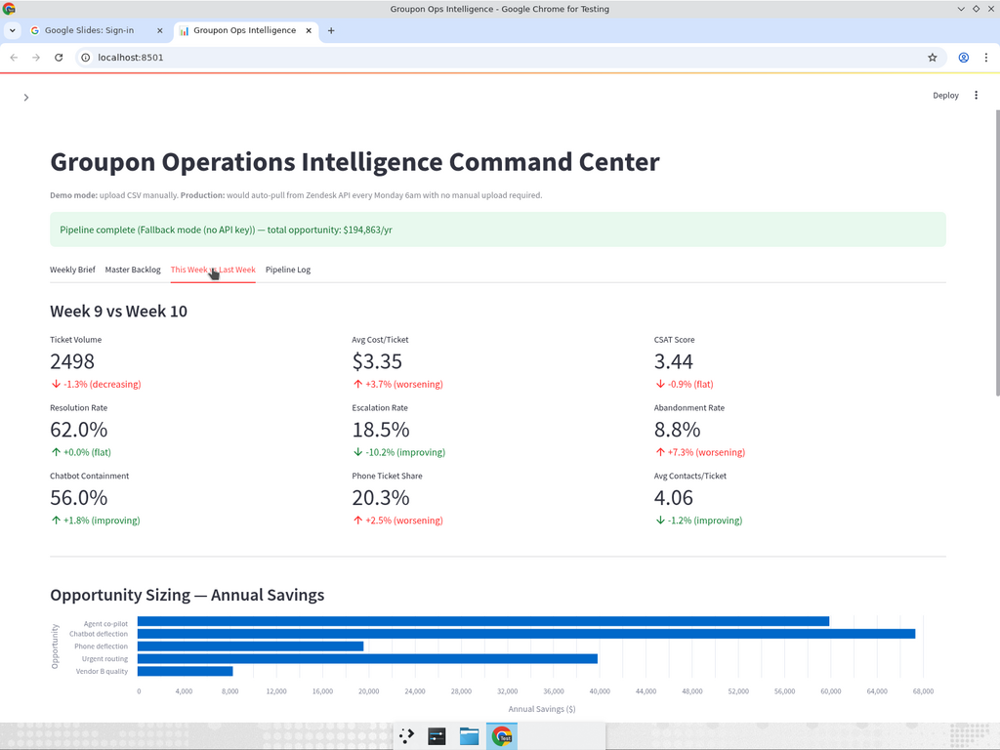
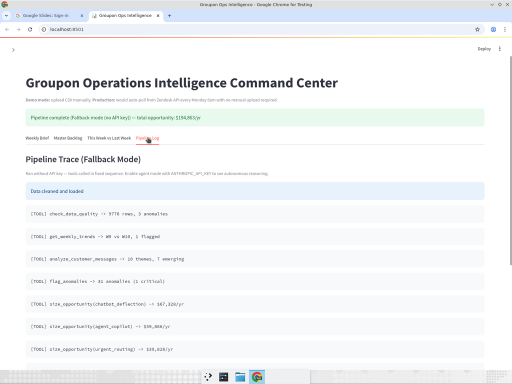

# Groupon Operations Intelligence Command Center

An AI-powered operations intelligence system built for Groupon's Customer Operations team. The system ingests ~10,000 weekly support tickets, runs a multi-step analytical pipeline with autonomous agent reasoning, and produces a structured weekly "Ops Intelligence Brief" with actionable insights worth ~\$195K/yr in identified savings.

## Screenshots

### Weekly Brief
Executive summary with KPI callouts, Top 5 issues (expandable cards with root cause, action, owner), week-over-week comparison, recommended actions table, watch list of emerging NLP patterns, and a download button.



### Master Backlog
Persistent tracking of the top 5 improvement opportunities with signal values, targets, trends, and line charts showing each opportunity's trajectory toward its goal over time.



### This Week vs Last Week
Nine metrics with direction-aware coloring (the system knows "cost down = good, CSAT down = bad"), opportunity sizing bar chart, WoW comparison table, team performance heatmap, and NLP theme analysis.



### Pipeline Log
Full trace of the agent's tool calls, reasoning steps, and guardrail checks. In agent mode (with API key), this shows Claude's autonomous decision-making between tool calls.



---

## Key Findings

Analysis of 4 weeks of ticket data (9,776 clean tickets) identified **5 improvement opportunities worth \$194,863/yr**:

| # | Opportunity | What It Means | Annual Savings | Range |
|---|-------------|---------------|----------------|-------|
| 1 | Chatbot deflection | Route more simple tickets to AI chatbot instead of expensive human agents | \$67,328 | \$50K–\$84K |
| 2 | Agent co-pilot | Give human agents an AI sidebar that suggests responses, reducing back-and-forth per ticket | \$59,886 | \$42K–\$78K |
| 3 | Urgent routing fix | Stop sending urgent tickets to the chatbot; route them to senior human agents | \$39,828 | \$32K–\$48K |
| 4 | Phone-to-chat deflection | Redirect phone callers to chat, same satisfaction, 3.5x cheaper | \$19,566 | \$16K–\$23K |
| 5 | Vendor B quality | Train/QA Vendor B agents to match Vendor A, fewer contacts, better CSAT | \$8,255 | \$6K–\$11K |

**Critical anomaly:** 238 urgent tickets were misrouted to the AI chatbot (54% resolution vs 72% for human agents). This is a config fix that can ship this week.


## How It Works

### The Agent Pipeline

The AI agent has **7 tools** but is NOT following a script. Claude autonomously decides which tools to call and in what order based on what the data shows:

1. **Data Quality Checks** (`check_data_quality`) — scans for missing values, duplicates, type mismatches
2. **Trend Detection** (`get_weekly_trends`) — computes 9 week-over-week metrics across all channels/teams
3. **Anomaly Flagging** (`flag_anomalies`) — statistical scan finds 31 anomalies including the urgent routing failure
4. **NLP Theme Analysis** (`analyze_customer_messages`) — TF-IDF bigram analysis on 9,776 customer messages to find emerging complaint patterns
5. **Opportunity Sizing** (`size_opportunity`) — computes annual savings with data-driven formulas and confidence ranges
6. **Metric Drill-Down** (`analyze_metric`) — deep-dive into any metric by channel, team, or priority
7. **Brief Generation** (`generate_brief`) — compiles all findings into the structured weekly brief

Between tool calls, the agent **reasons about what it found** and decides what to investigate next. For example, after finding 31 anomalies, the agent autonomously chose to drill into Vendor B's performance — that wasn't scripted.

### Three Guardrails

1. **Tool Coverage Check** — verifies all 5 opportunities were sized; backfills any the agent missed
2. **Brief Validation** — confirms the brief has all 4 required sections (Top 5, WoW, Actions, Watch List)
3. **Max Retries + Fallback** — if the agent fails after 20 iterations, falls back to deterministic mode so the pipeline always produces output

### Fallback Mode

When no API key is available, the system runs all tools in a fixed sequence. The dashboard looks identical — only the Pipeline Log tab shows the difference (fixed sequence vs autonomous reasoning).

## Installation

```bash
pip install -e .
# or
pip install -r requirements.txt
```

## Environment Setup

```bash
cp .env.example .env
# Edit .env with your keys:
#   ANTHROPIC_API_KEY=your_key_here      (required for agent mode)
#   SLACK_WEBHOOK_URL=your_webhook_here  (optional, Slack notifications)
```

## Quick Start

```bash
# Launch the dashboard (handles everything)
streamlit run app.py
```

Click **Run Analysis** in the sidebar. The dashboard will:
1. Clean the raw CSV data (dedup, parse dates, derive fields)
2. Run the AI agent pipeline (or fallback mode if no API key)
3. Update the master backlog with signal values
4. Send a Slack notification (if webhook is configured)
5. Display results across 4 tabs

### Running Scripts Individually

```bash
# 1. Clean the raw data
python3 analysis/clean.py

# 2. Run exploratory analysis and opportunity sizing
python3 analysis/analyze.py

# 3. Export results to Google Sheets (requires credentials.json)
python3 analysis/sheets_export.py

# 4. Run the AI agent pipeline directly
python3 agent/pipeline.py

# 5. Launch the Streamlit dashboard
streamlit run app.py
```

## Project Structure

```
groupon-cos-case/
├── README.md
├── pyproject.toml                     # Package config with all dependencies
├── .env.example
├── .gitignore
├── data/
│   ├── option_a_ticket_data.csv       # Raw input (10,000 tickets)
│   └── tickets_clean.csv              # Generated by clean.py
├── analysis/
│   ├── clean.py                       # Data cleaning & quality report
│   ├── analyze.py                     # Full EDA & opportunity sizing
│   └── sheets_export.py              # Google Sheets export
├── agent/
│   ├── tools.py                       # 7 agent tools (Anthropic SDK schemas)
│   ├── pipeline.py                    # Agentic pipeline with guardrails
│   ├── backlog.py                     # Backlog tracking with auto-resolution
│   ├── slack_notify.py               # Slack webhook notifications
│   └── backlog_state.json            # Persistent backlog state
├── app.py                             # Streamlit frontend (4 tabs)
├── tests/
│   └── test_tools.py                  # 20 unit tests for all tools
├── docs/
│   └── screenshots/                   # Dashboard screenshots
└── output/
    ├── analysis_results.xlsx          # Excel workbook (5 tabs)
    ├── weekly_brief.md               # Generated weekly brief
    └── slack_message.json            # Last Slack message payload
```

## Tech Stack

- **Frontend:** Streamlit (4-tab dashboard with KPI cards, charts, tables)
- **AI Agent:** Anthropic Python SDK with tool use (no LangChain)
- **Data Processing:** Pandas + NumPy
- **NLP:** TF-IDF bigram analysis (scikit-learn) on customer messages
- **Notifications:** Slack Incoming Webhooks
- **Persistence:** JSON file for backlog state across weeks
- **Testing:** pytest (20 unit tests)

## Assumptions

All costs and rates come directly from the CSV data. Only the targets are assumed:
- 43% chatbot deflection rate (up from 27.9%)
- 20% phone-to-chat redirect rate
- 3.5 contacts/ticket with co-pilot (down from 4.09)
- \$100 average order value for lost-order calculation
- Annualized at 13x (4 weeks of data x 13 = 52 weeks)
- Ranges reflect +/-20-30% uncertainty based on confidence level
